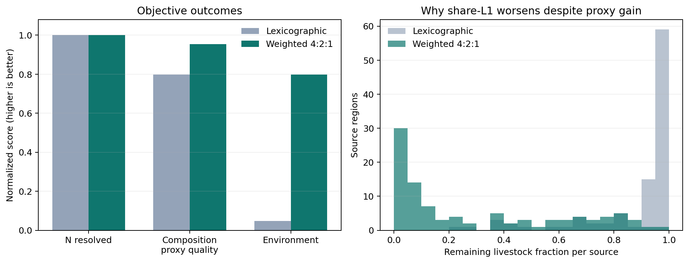

# EU 统一加权 4:2:1 MILP 实验结果

## 结论先行

EU 已跑通。统一目标为

`J = 4 × N消解率 - 2 × 源区域构成代理损失 + 1 × 环境归一化得分`。

SCIP 在 15.79 秒内达到 `gaplimit`，相对 MIP gap 为 `0.01008%`，优于预先设定的 `0.1%` 证书门槛，因此这是一个有证书的统一加权解。端到端耗时 22.82 秒，峰值内存 635.26 MiB；计时期间澳大利亚 exact-primary 任务同时运行，不能当作独占机器基准。

与已有 EU 词典序结果相比，加权解只少消解 `9,138.50 kg` N（相对下降 `0.000543%`），但环境归一化得分从 `0.04837` 升到 `0.79847`，源区域“同畜种移出率”代理损失从 `0.20263` 降到 `0.04578`。按同一个 4:2:1 评分回算，加权解从 `3.64310` 提升到 `4.70688`，提高 `29.20%`。

代价也非常明显：转移动物从 `344,568,496` 增加到 `3,301,930,822`，增加 `858.28%`，主要是肉鸡从 `180,748,605` 增至 `3,109,365,233`。这说明当前目标没有惩罚转移数量；环境项会奖励把大量低 N 系数动物送到高环境得分目的地。

## 核心对比

| 指标 | 词典序 | 加权 4:2:1 | 加权相对变化 |
|---|---:|---:|---:|
| 源端 N 消解率 | 99.9999953% | 99.9994523% | -0.000543% |
| 源端 N 消解量 | 1,682,922,511.87 kg | 1,682,913,373.37 kg | -9,138.50 kg |
| 源区域移出率代理损失（越低越好） | 0.202635 | 0.045784 | -77.41% |
| 实际剩余牲畜 share-L1 均值（越低越好） | 0.129542 | 0.807357 | +523.24% |
| 环境归一化得分 | 0.048368 | 0.798468 | +1550.81% |
| 4:2:1 统一评分 | 3.643099 | 4.706878 | +29.20% |
| 转移动物总数 | 344,568,496 | 3,301,930,822 | +858.28% |

## 为什么代理损失改善，实际构成变化反而变差

这不是计算错误，而是当前线性代理的边界条件暴露出来了。

代理要求同一源区域中各畜种的**移出率尽量相等**。当每个畜种都移走接近相同比例时，代理损失会很小；但如果这个共同移出率接近 100%，区域只剩下很少动物，整数舍入就会让剩余构成比例非常敏感，实际 before/after share-L1 反而可能很大。

加权解中：

- 每个源区域平均只剩原库存的 `30.03%`，中位数只剩 `13.38%`；
- 30 个源区域剩余不足 5%；
- 44 个源区域剩余不足 10%；
- 词典序解没有任何源区域剩余不足 10%，其中 90/98 个区域仍保留超过 50%。

因此，“移出率接近”只有在保有量不逼近零时，才是稳定的构成保持代理。下一版若强调真实剩余构成，应增加最小保有比例，或直接采用分段线性化/其他可解释的构成指标。

## 求解与验证

| 项目 | 结果 |
|---|---:|
| SCIP 状态 | `gaplimit` |
| 证书 | 通过（目标 ≤ 0.1%） |
| 实际相对 gap | 0.01008% |
| primal / dual bound（求解器放大目标） | 4,706,877.252 / 4,707,351.646 |
| SCIP 内部时间 | 15.79 s |
| `solve()` 墙钟 | 16.83 s |
| 建模 | 5.37 s |
| 输入加载 | 0.20 s |
| 序列化 | 0.32 s |
| 端到端 | 22.82 s |
| 峰值内存 | 635.26 MiB |
| 整数移动变量 | 71,133 |
| 连续构成变量 | 641 |
| 总变量 / 约束 | 71,774 / 2,019 |

独立验证全部通过：ID/行数、整数非负、源端库存、牲畜守恒、路线重算、物种可接收性、N 与氨容量（按既定数值尺度容差）、三个归一化目标、统一目标以及保存后的 N/氨字段均可重算。目的地氨严格重算最大超出 `0.465 kg`，但在预先采用的 `1e-6 × capacity` 数值尺度容差内。

## 当前研究判断

1. 单次统一加权 MILP 比三级词典序快得多，且在 EU 上很容易达到 0.1% gap 证书；但这不只是“求解器更快”，模型也取消了两次重求解与前层锁定。
2. 4:2:1 的归一化权重确实形成了可观察的目标权衡：几乎不损失 N，大幅换取环境得分和代理损失改善。
3. 当前方案会移动极大量肉鸡，暴露了缺少移动成本/规模约束的问题。
4. 当前线性构成代理在近乎清空源区域时不再可靠地代表实际剩余构成，应作为下一轮模型修正重点。
